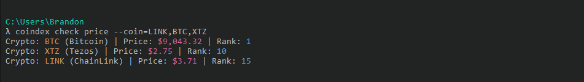

# Intro
This is a pretty basic CLI created from a tutorial to get a feel for creating CLIs using Node.js. In order to use the CLI you'll need to register for an API key at https://nomics.com. I listed and provided examples of the commands below. Enjoy 👍

# Modules Used
* Commander.js - Allows us to have a really nice syntax to handle options, get commands, and run certain actions for those commands.
* Inquirer.js - Used to prompt the user for the API key and use that input.
* ConfigStore - Allows us to store/get/delete config values.

# CLI Commands
* Key - Manage your Nomics API key.
    * Set - Set your API key.
    
    * Show - Show your API key.
    
    * Remove - Remove your API key.
    

* Check - Check Crypto Price Info.
    * Price - Check price of cryptos ( Defaults to BTC, ETH, LTC, XTZ, ZEC and USD as the currency ).
    
        * --coin - Add specific crypto ticker symbols in CSV format.
        
        
        * --cur - Change the currency.
        